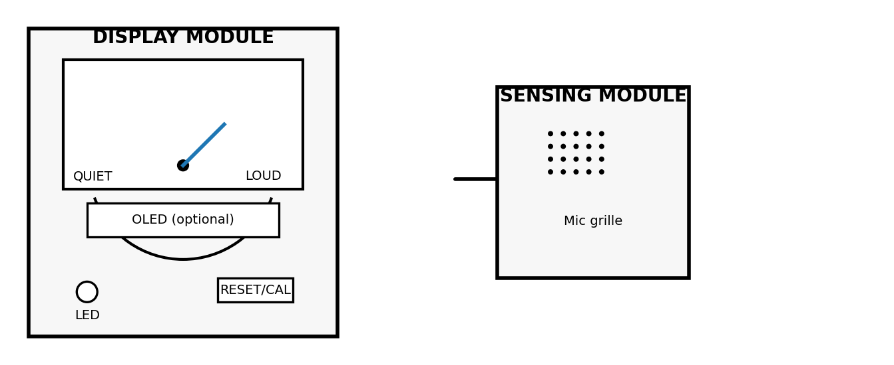
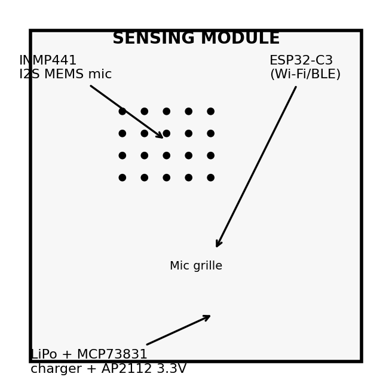
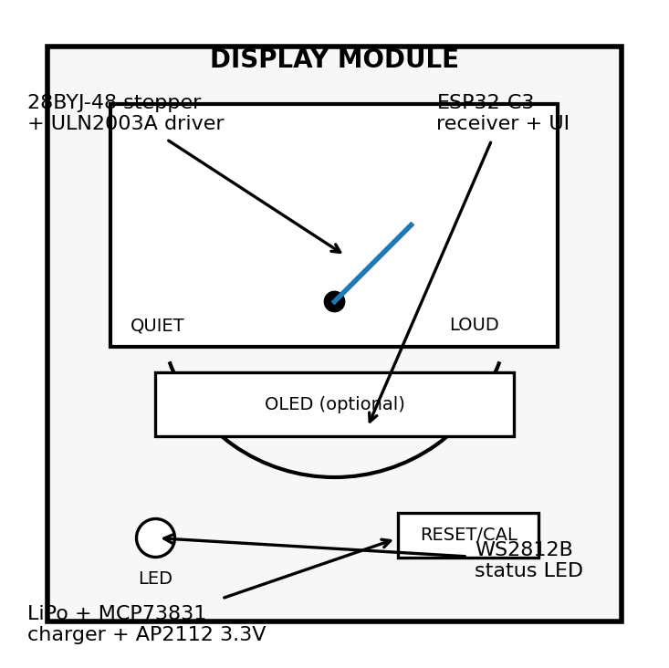
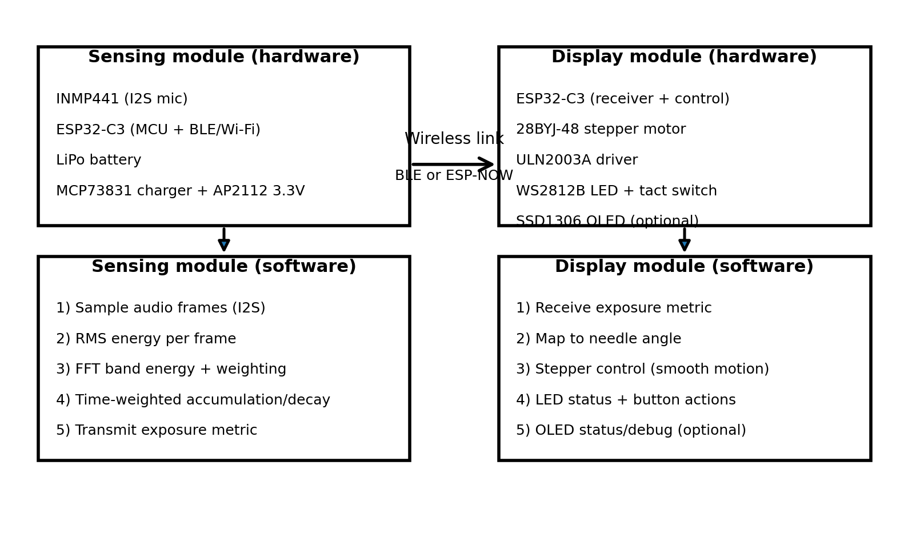

# Acoustic Dosimeter

A two-device, wireless **acoustic dosimeter** that estimates cumulative sound exposure over time and presents it as a slow-moving analog gauge needle. A compact sensing node performs DSP (RMS + FFT band-energy features + time-weighted integration) and transmits a single exposure metric to a tabletop display with a stepper-driven needle, LED status, and a button.

---

## 1) Overview Slide (Title, What it Does, General Sketch)

**What it does (1-3 sentences):** The sensing module continuously samples ambient audio using a MEMS microphone, extracts energy and frequency features (RMS + FFT band energy), and integrates them over time into a single **exposure index**. The display module receives that index wirelessly and visualizes it as a slow-moving gauge needle, with an LED and a single button for reset/calibration.

**Physical features (sketch):** see general sketch above.

---

## 2) Sensor Device (Detailed Sketch + How it Works)

**Role:** Captures ambient audio, runs DSP locally, and transmits a single cumulative exposure metric.

**How it works (high level):**
- The microphone provides a digital I2S audio stream.
- The MCU computes short-window RMS and FFT band energies (e.g., 125 Hz-4 kHz bands), then applies time-weighted integration (accumulate during sustained loudness, decay during quiet).
- The sensor node transmits an exposure value (0-100) periodically (e.g., 1-5 Hz) to the display node.

**Key parts (with part numbers):**
- **MCU / Wireless:** ESP32-C3 (RISC-V Wi-Fi + BLE) (datasheet in `datasheets/ESP32-C3_datasheet_en.pdf`) 
- **Microphone:** INMP441 MEMS I2S microphone (datasheet in `datasheets/INMP441_MEMS_microphone_datasheet.pdf`)
- **Power (battery-only):** 1-cell LiPo + MCP73831 Li-ion/LiPo charger IC (datasheet in `datasheets/MCP73831_LiPo_charger_datasheet_Microchip.pdf`) + AP2112 3.3 V LDO regulator (datasheet in `datasheets/AP2112_LDO_datasheet.pdf`)

**Early technical thoughts (wireless, power, processing):** The sensor module concentrates processing (RMS + FFT + integration) on an ESP32-C3 and uses ESP-NOW (or BLE) to transmit a single exposure metric, minimizing bandwidth and improving privacy by not sending raw audio. Power will be managed with duty-cycling (batching FFT windows + deep sleep between updates) to support battery-only operation.

---

## 3) Display Device (Detailed Sketch + How it Works)

**Role:** Receives the exposure index and visualizes it as an analog gauge needle; provides minimal user interaction.

**How it works (high level):**
- The display MCU receives exposure updates wirelessly.
- A stepper motor drives the needle to a mapped angle (e.g., 0-100 -> 0-180 degrees) with smoothing to avoid jitter.
- A single LED provides status (OK / caution / high exposure) and a button triggers reset or calibration.
- (Optional) OLED can show the numeric exposure value and battery state.

**Key parts (with part numbers):**
- **MCU / Wireless:** ESP32-C3 (same family as sensor node)
- **Stepper motor (needle):** 28BYJ-48 5 V stepper motor (datasheet in `datasheets/28BYJ-48_stepper_motor_datasheet.pdf`)
- **Stepper driver:** ULN2003A Darlington array (datasheet in `datasheets/ULN2003A_datasheet_TI.pdf`)
- **LED:** WS2812B addressable RGB LED (datasheet in `datasheets/WS2812B_RGB_LED_datasheet.pdf`) (can be used as a single LED)
- **Optional display:** SSD1306-based 128x64 OLED over I2C (controller datasheet in `datasheets/SSD1306_OLED_controller_datasheet.pdf`)
- **Button:** 6x6 mm tact switch (generic)

**Early technical thoughts (wireless, power, processing):** The display device keeps processing minimal (receive metric + gauge control + UI), prioritizing stable stepper motion and low power draw. Because the stepper dominates energy use, the display will use a thoughtfully sized larger LiPo and will only move the needle when the metric changes meaningfully.

---

## 4) Communication + Detailed HW/SW Diagram (2 Figures)

### Figure A: Device-to-Device Communication

### Figure B: Detailed System Architecture (HW + SW)

**How the two devices communicate:** The sensing node transmits an exposure index (0-100) over ESP-NOW (or BLE) at a low update rate; the display node acknowledges receipt (optional) and uses smoothing before commanding the stepper position. This keeps the link reliable and low-power while preserving privacy by keeping raw audio on the sensing device.

---

## Datasheets

All component datasheets are stored in the `datasheets/` folder.
